# Svario teknisk arkitektur

Dette dokumentet beskriver Svario slik applikasjonen er bygget i repoet: en React/Vite single page application med Supabase som backend for auth, database, RLS, RPC-er og Edge Functions.

Dokumentet er skrevet som en teknisk arkitekturtegning: bokser, piler, dataflyt, ansvarsgrenser og konkrete spesifikasjoner.

## 1. Systemkontekst

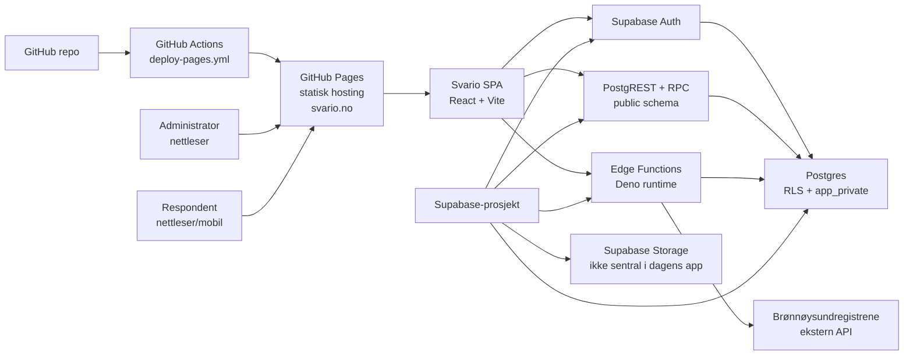

Hovedideen er enkel:

- Frontend er en statisk bygget SPA som lastes fra GitHub Pages.
- All applikasjonsdata ligger i Supabase/Postgres.
- Nettleseren bruker kun Supabase publishable key.
- Hemmelige nøkler, spesielt service-role, skal bare brukes server-side i Edge Functions.
- Row Level Security bestemmer hva innloggede brukere og anonyme respondenter får lese og skrive.

## 2. Runtime-arkitektur

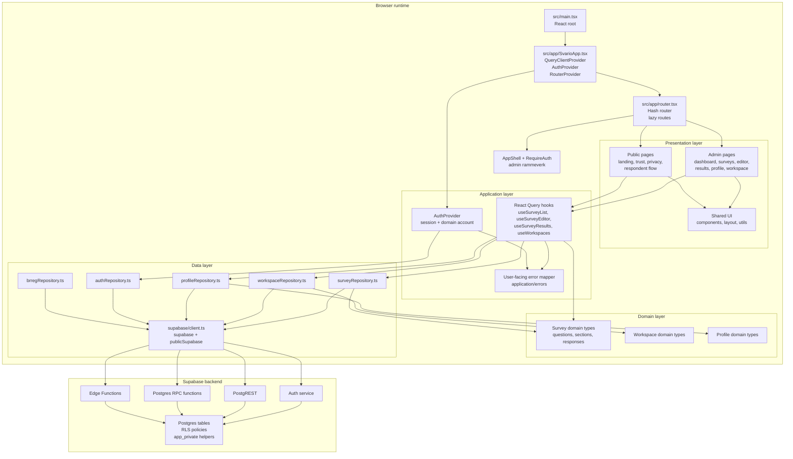

## 3. Lagdeling i repoet

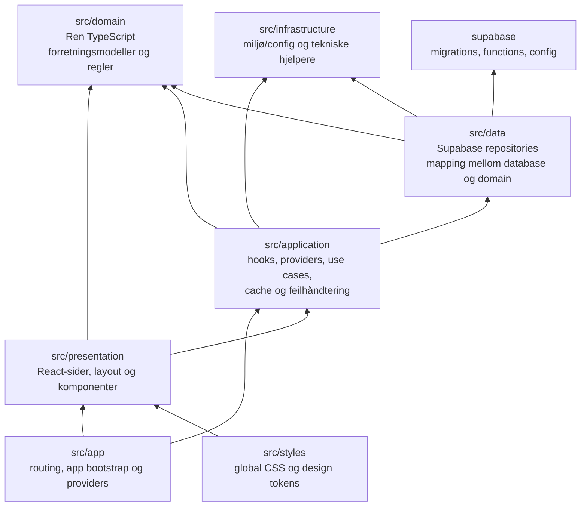

Avhengighetsregelen er:

- `domain` skal ikke importere React, Supabase eller UI.
- `data` kjenner Supabase og oversetter databaseformat til domenemodeller.
- `application` orkestrerer brukerflyt, React Query-cache, auth-state og feilmeldinger.
- `presentation` viser skjermbilder og kaller hooks, men bør ikke gjøre direkte databasekall.
- `app` kobler sammen router, providers og globale rammer.
- `supabase/` er backendens kildekode: migrasjoner, RLS, SQL-funksjoner og Edge Functions.

## 4. Viktige mapper og ansvar

| Område | Ansvar | Typiske filer |
| --- | --- | --- |
| `src/app` | Starter appen, registrerer router og globale providers | `SvarioApp.tsx`, `router.tsx`, `routes.ts` |
| `src/presentation/admin` | Adminflater for innloggede brukere | dashboard, survey list, editor, results, profile |
| `src/presentation/public` | Offentlige sider og respondentflyt | landing, trust, privacy, respondent |
| `src/presentation/shared` | Gjenbrukbar UI og layout | `AppShell`, knapper, statuser, hjelpetekster |
| `src/application/auth` | Auth-session, domain account bootstrap og login/logout | `AuthProvider.tsx` |
| `src/application/surveys` | Survey use cases og React Query hooks | list, editor, public survey, results |
| `src/application/errors` | Sentral maskering av tekniske feil til brukertrygge meldinger | `userFacingError.ts` |
| `src/data/supabase` | Supabase browserklienter og genererte databasetyper | `client.ts`, `types.ts` |
| `src/data/*` | Repositories som gjør database-, RPC- og function-kall | survey, auth, workspace, profile, brreg |
| `src/domain/*` | Domenetyper, enums og rene regler | survey, workspace, profile, organization |
| `supabase/migrations` | Database, RLS, RPC-er og helper-funksjoner | SQL-migrasjoner |
| `supabase/functions` | Server-side kode med mulighet for hemmelige nøkler | `delete-account`, `lookup-organization` |
| `.github/workflows` | CI/deploy til GitHub Pages | `deploy-pages.yml` |

## 5. Routing og skjermtopologi

Svario bruker hash routing fordi appen hostes statisk på GitHub Pages. Det gjør at URL-er under samme statiske entry point kan rutes i klienten.

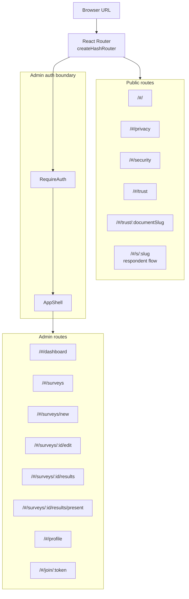

Teknisk konsekvens:

- Public respondent route kan lastes uten innlogging.
- Admin routes krever Supabase-session og ferdig initialisert domain account.
- GitHub Pages trenger bare å levere `index.html` og statiske assets.

## 6. Auth, identitet og domain account

Svario skiller mellom Supabase Auth-brukeren og Svarios eget konto-/brukerbegrep. Dette er viktig fordi appens eierskap og RLS skal peke mot domain account, ikke direkte mot `auth.users.id`.

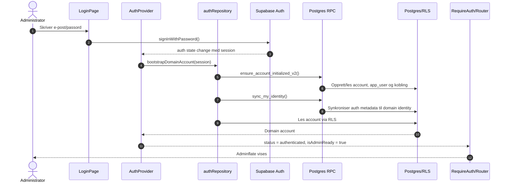

Identitetsmodellen kan leses slik:

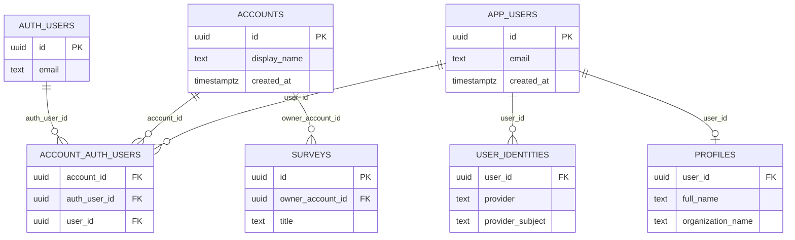

Konsekvens for ny kode:

- Bruk `account.id` som Svario-eierskap i appen.
- Ikke bruk `auth.users.id` som direkte eier av surveys, workspaces eller andre forretningsobjekter.
- La databasefunksjoner hente gjeldende konto via `app_private.current_account_id()` eller tilsvarende helper.

## 7. Respondentflyt og offentlig datatilgang

Respondentflyten bruker en separat Supabase-klient uten persistent session. Det gjør at offentlig svarflyt ikke blander seg med en eventuell adminsession i samme nettleser.

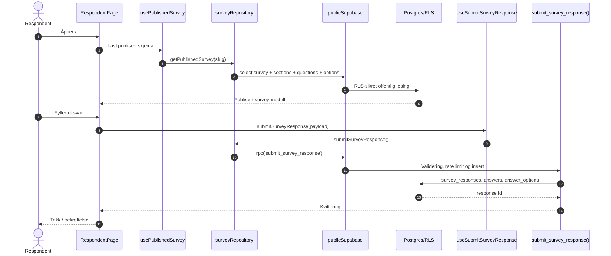

Offentlig tilgang skal være smal:

- Lesing: kun publiserte surveys og data som trengs for å svare.
- Skriving: kun gjennom validerte RPC-er eller RLS-regler som er laget for respondentbruk.
- Ingen adminspørringer skal kunne kjøres anonymt.

## 8. Admin dataflyt for survey editor

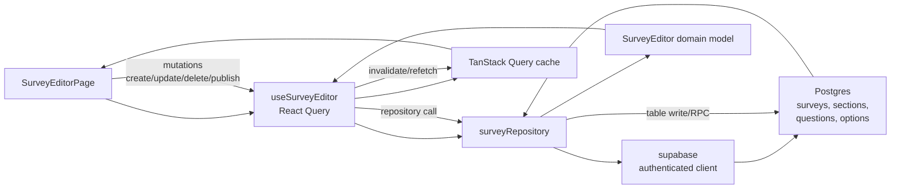

Arkitekturintensjonen er at editoren ikke skal vite hvordan databasekallet ser ut. Den skal jobbe mot application hooks og domenemodeller. Repository-laget tar seg av Supabase-format, joins, RPC-er, mapping og tekniske feil.

## 9. Resultater, eksport og presentasjon

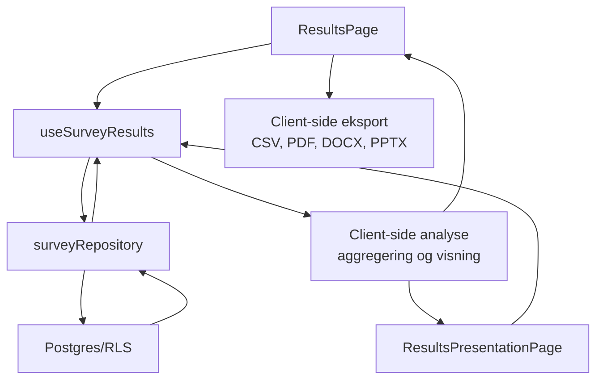

Resultatsiden er en adminflate og skal derfor ligge bak `RequireAuth`. Datatilgang skal være RLS-sikret slik at bare eier eller autoriserte workspace-medlemmer kan hente resultater.

## 10. Feilhåndtering og brukertrygge meldinger

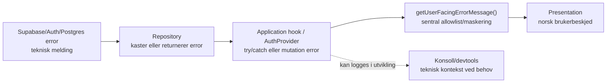

Prinsippet er:

- Tekniske databasefeil skal ikke vises direkte til brukeren.
- Kjente validerings- og auth-feil oversettes til forståelige norske meldinger.
- Ukjente feil får en rolig fallback, for eksempel at noe gikk galt og at brukeren kan prøve igjen.
- Repository-laget kan fortsatt bevare teknisk feilobjekt for debugging, men UI skal gå via `application/errors`.

## 11. Database- og RLS-arkitektur

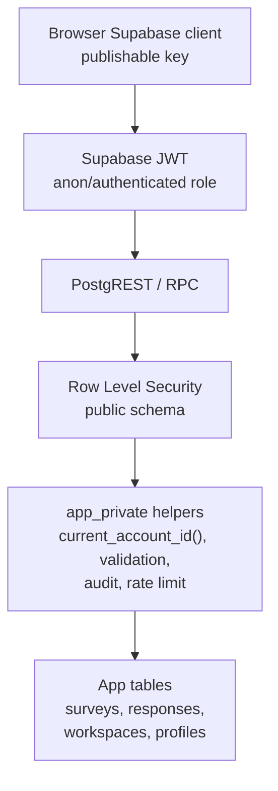

Databaseregler:

- RLS skal være aktiv på apptabeller som eksponeres via Supabase API.
- Policies bør være eksplisitte for `authenticated` og `anon`.
- Adminoperasjoner skal sjekke domain account eller workspace-medlemskap.
- Respondentoperasjoner skal være begrenset til publiserte skjemaer og validerte inserts.
- `app_private` brukes for interne hjelpefunksjoner og sikkerhetslogikk som ikke skal være direkte API-flate.

## 12. Survey-datamodell

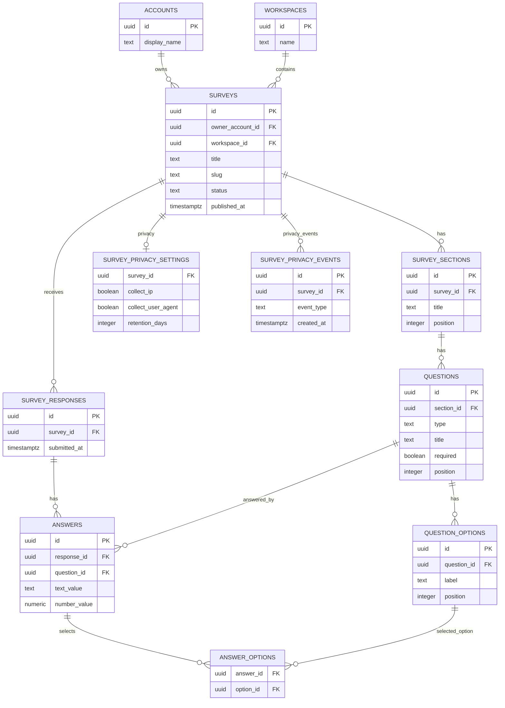

Denne modellen er normalisert rundt survey-strukturen:

- Survey eier seksjoner.
- Seksjoner eier spørsmål.
- Spørsmål kan ha alternativer.
- En survey mottar responses.
- En response eier answers.
- Answers kan peke til valgte alternativer via koblingstabell.

## 13. Workspace-modell

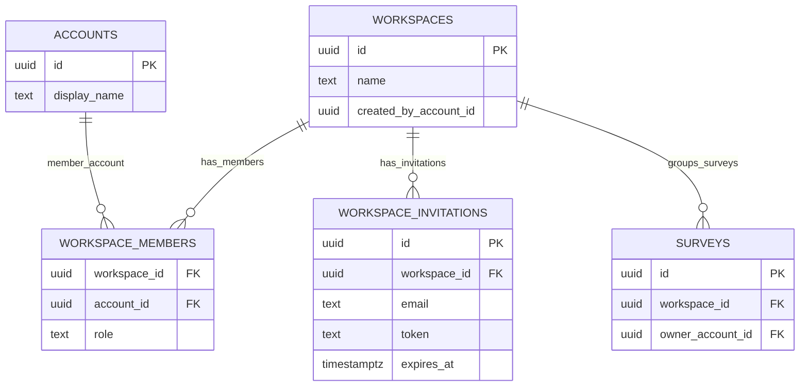

Workspace gir en gruppeflate rundt surveys, men endrer ikke grunnregelen om at domain account er sentral identitet for eierskap og tilgang.

## 14. Supabase-klienter i frontend

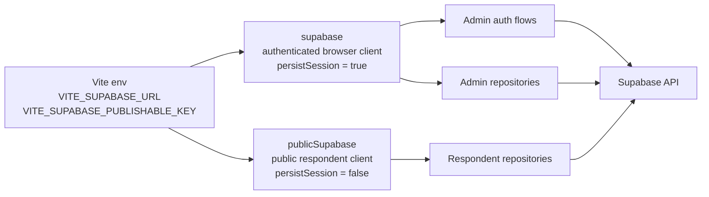

Klientene har ulike roller:

- `supabase` brukes der brukerens session skal følge med.
- `publicSupabase` brukes for offentlig respondentflyt uten persistent login-state.
- Ingen av klientene skal inneholde service-role key.

## 15. Edge Functions

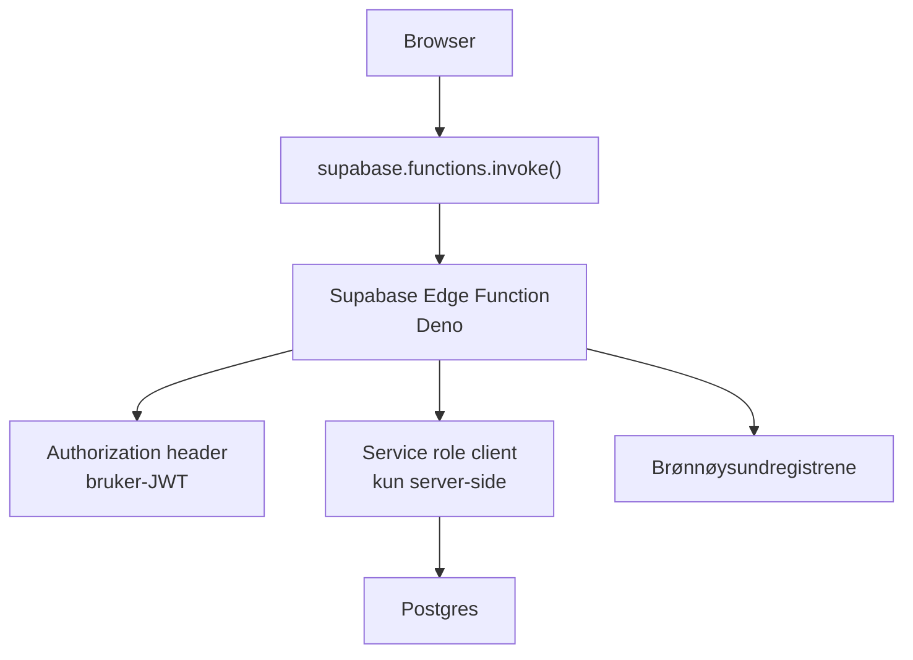

Eksisterende funksjoner:

| Function | Ansvar | Sikkerhetsmodell |
| --- | --- | --- |
| `delete-account` | Slette kontodata og auth-bruker | Validerer bruker-JWT, bruker service-role server-side |
| `lookup-organization` | Slå opp organisasjon i Brønnøysundregistrene | Validerer innlogging, kaller ekstern API fra server-side |

Edge Functions brukes når nettleseren ikke bør eller ikke kan gjøre jobben direkte:

- hemmelige nøkler
- ekstern API-integrasjon
- administrative Supabase-operasjoner
- operasjoner som trenger ekstra server-side validering

## 16. Deploy- og buildflyt

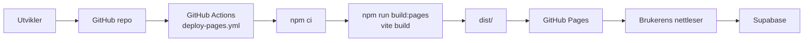

Build og deploy:

- Lokalt brukes vanligvis `npm run build` som verifikasjon.
- GitHub Pages bruker `npm run build:pages`.
- Produksjonsvariabler injiseres som Vite-variabler under build.
- Resultatet er statiske filer i `dist/`.

## 17. Teknisk spesifikasjon

| Del | Valg | Kommentar |
| --- | --- | --- |
| Frontend runtime | Browser SPA | Ingen egen Node-server i produksjon |
| UI framework | React 19 | Komponentbasert admin- og respondentflate |
| Build tool | Vite 7 | Rask dev-server og statisk produksjonsbuild |
| Språk | TypeScript 5.9 | Typing på tvers av UI, domain og data |
| Routing | React Router 7 + hash router | Passer statisk hosting på GitHub Pages |
| Server state | TanStack React Query 5 | Caching, mutations, invalidation og loading/error-state |
| Backend client | `@supabase/supabase-js` 2.x | Auth, PostgREST, RPC og Edge Functions |
| Database | Supabase Postgres | RLS, SQL-funksjoner, migrasjoner |
| Auth | Supabase Auth | Session i browser, domain account bootstrap i appen |
| Server-side funksjoner | Supabase Edge Functions | Deno runtime for hemmeligheter og eksterne API-er |
| Hosting | GitHub Pages | Statisk hosting av bygget SPA |
| Diagrammer | Mermaid i Markdown | Kan rendres av GitHub og mange Markdown-verktøy |
| Eksport | `papaparse`, `jspdf`, `docx`, `pptxgenjs` | Klient-side eksport fra resultater |
| Grafer | Recharts | Visualisering av surveyresultater |
| Ikoner | lucide-react | Lettvektige UI-ikoner |

## 18. Miljøvariabler og hemmeligheter

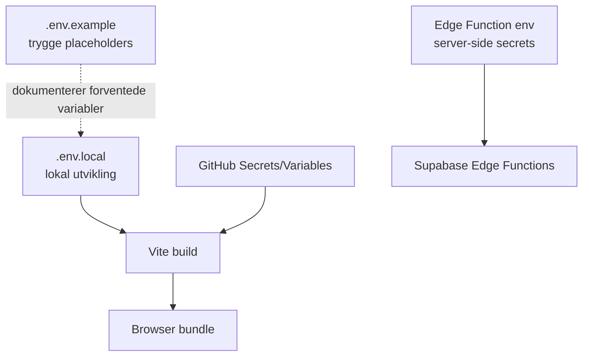

Regler:

- `VITE_SUPABASE_URL` og `VITE_SUPABASE_PUBLISHABLE_KEY` kan bygges inn i frontend.
- Service-role keys skal aldri inn i Vite-variabler eller frontend-bundle.
- Lokale hemmeligheter hører hjemme i `.env.local`.
- `.env.example` skal bare inneholde placeholders.
- Edge Function secrets håndteres i Supabase-miljøet.

## 19. Cache- og invalidationmodell

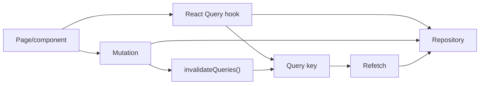

Typiske query keys:

- Survey list
- Survey editor
- Published survey
- Survey results
- Workspaces
- Profile

Retningslinje:

- Lesing skjer gjennom query hooks.
- Skriving skjer gjennom mutations.
- Mutations skal invalidere relevante query keys slik at UI-et henter ferske data.

## 20. Hvor ny kode bør plasseres

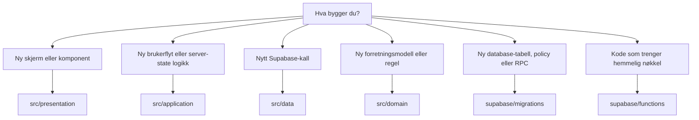

Praktisk tommelfingerregel:

| Behov | Plassering |
| --- | --- |
| Ny knapp, modal, side eller layout | `src/presentation` |
| Ny hook for lasting/lagring og UI-state | `src/application` |
| Ny databaseforespørsel, RPC-kall eller function invoke | `src/data` |
| Ny type, status, valideringsregel eller domenebegrep | `src/domain` |
| Ny tabell, indeks, RLS-policy eller SQL-funksjon | `supabase/migrations` |
| Ny operasjon med hemmelighet/service-role/ekstern serverintegrasjon | `supabase/functions` |
| Ny global stil/design token | `src/styles` |

## 21. Arkitekturmessige kvaliteter

| Kvalitet | Hvordan arkitekturen støtter det |
| --- | --- |
| Sikkerhet | RLS, domain account, service-role kun server-side, smal public client |
| Deploybarhet | Statisk Vite-build til GitHub Pages |
| Lesbarhet | Lagdelt repo med tydelig avhengighetsretning |
| Testbarhet | Domain/data/application kan testes mer målrettet enn store UI-flater |
| Robusthet | React Query håndterer loading, retry, invalidation og cache |
| Brukeropplevelse | Sentral feilmeldingsmapping hindrer tekniske databasefeil i UI |
| Evolusjon | Nye use cases kan legges vertikalt innenfor eksisterende lag |

## 22. Arkitekturprinsipper for videre utvikling

1. Hold databasekall i `src/data`.
2. Hold brukerflyt og caching i `src/application`.
3. Hold React-komponenter fri for Supabase-detaljer.
4. Hold domenemodeller rene og uavhengige.
5. Bruk migrasjoner for databaseendringer.
6. La RLS være den siste sikkerhetsgrensen, ikke bare UI-logikk.
7. Ikke vis rå database- eller auth-feil direkte til brukeren.
8. Ikke bland Supabase Auth-id med Svario domain account-id.
9. Ikke legg serverhemmeligheter i frontend.
10. Bruk Edge Functions når en operasjon krever service-role, hemmeligheter eller ekstern API-logikk.

